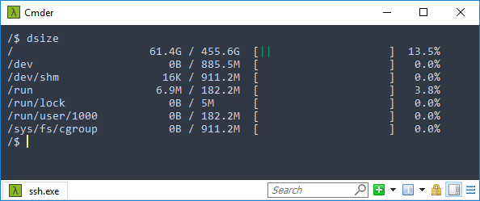
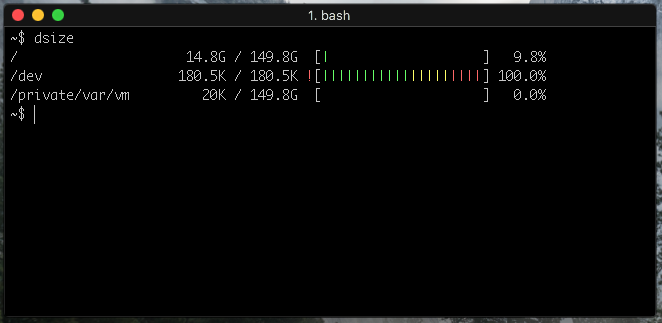
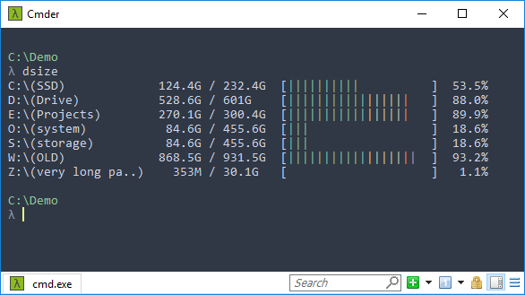

# Edgar.DriveSpace
A terminal program for Windows/Linux that shows partitions and used/total space as well as a bar to represent said space.  
That is all it does, there are no command line arguments or other parameters.  
Written in C# and runs on .NET Core  

# Screenshots
Linux terminal through SSH  


OS X terminal  


Windows terminal  


# Installation
## Requirements
* .NET Core 2.0 or higher installed on the machine to compile the source.  
To see if it's installed run `dotnet --version` in terminal/console.
* Admin privileges (for installation only)

## Linux/OS X
1) In terminal run  
```
git clone https://github.com/EJLV/Edgar.DriveSpace.git
cd Edgar.DriveSpace
sudo ./install.sh
```
2) Follow the instructions  
3) Run `dsize` in terminal

## Windows
1) Clone or download project  
2) Run `install.bat` as admin (right click, run as admin) or call it from elevated cmd  
3) Follow instructions  
4) Run `dsize` in cmd/powershell/terminal  

